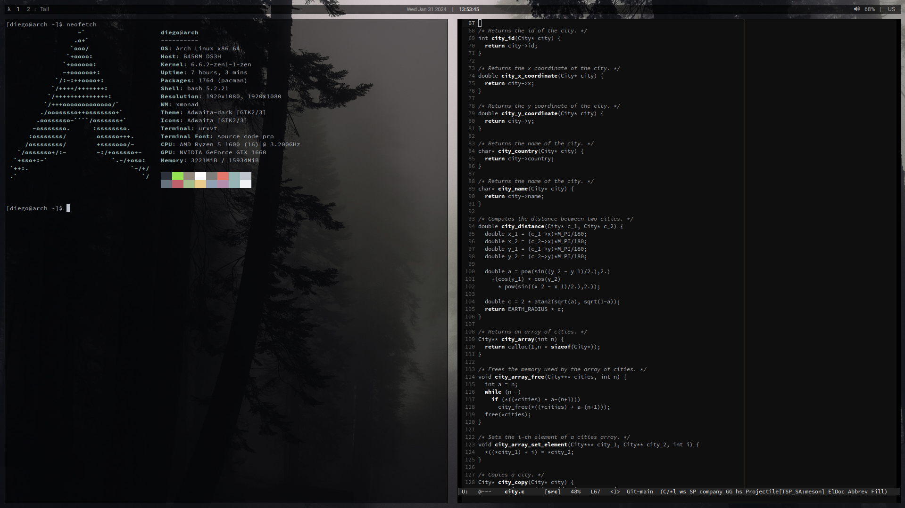

# Preview


# Paths

```
/boot/loader/loader.conf
~/.bashrch
~/.emacs.d/init.el
~/.emacs.d/Lambda-theme.el
~/.xinitrc
~/.xmobarrc
~/.xmonad/xmonad.hs
~/.xmonad/xmobar/icons/
~/.Xresources
~/.inputrc
/boot/loader/loader.conf
/etc/ly/config.ini
/etc/lf/lfrc
/usr/lib/urxvt/perL/pasta
/etc/X11/xorg.conf
/etc/X11/xorg.conf.d/50-mouse-acceleration.conf
```

# Dependencies

## Resize Font [urxvt]
```
https://github.com/simmel/urxvt-resize-font
```

## Emacs
Run:
```
M-x package-install-selected-packages
M-x all-the-icons-install-fonts
```

For faster racket:
```
M-x racket-mode-start-faster
```

## ly
```
https://github.com/fairyglade/ly
```

## lf
```
https://github.com/gokcehan/lf
```